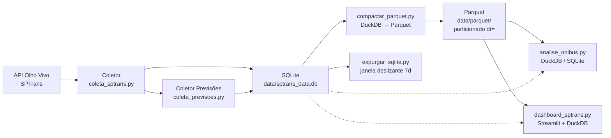

# 🚌 SPTrans Real-Time Public Transport Data Pipeline

Pipeline de coleta, processamento e visualização de dados em tempo real do
transporte público de São Paulo via API Olho Vivo da SPTrans.
*   **`analise`**: Módulo isolado de análise estatística de dados históricos.

---

## 🛠️ Stack Tecnológica

*   **Linguagem Core:** Python 3.11
*   **Infraestrutura e DataOps:** Docker, Docker Compose, Make
*   **Armazenamento de Dados:** SQLite (Time-series estruturado local)
*   **Visualização e BI:** Streamlit, Pandas, Plotly/Matplotlib
*   **Integrações:** Requests, urllib3 (com tratativas de conexões e retentativas)

---

## ⚡ Decisões de Engenharia & Resiliência
1. **Compartilhamento de Configurações (`x-base-service`)**: O arquivo Docker Compose usa a sintaxe de âncora YAML para compartilhar a fundação comum entre coletores, Jupyter e Streamlit, reduzindo a duplicação e simplificando a manutenção da imagem.
2. **Ingestão Concorrente Segura**: O design separa a coleta de posições geográficas e de previsões de parada em processos paralelos e autônomos. Se a API da SPTrans falhar em previsões, o mapeamento de posições continua rodando sem impacto.
3. **Resiliência e Recuperação de Falhas**: Configuração de `restart: unless-stopped` nos containers de coleta garante que falhas de rede com a API da SPTrans reiniciem a thread de consumo automaticamente sem intervenção humana.

---

## 🚀 Como Rodar o Pipeline

### Pré-requisitos
* Docker e Docker Compose instalados na máquina.
* Token de Acesso da API Olho Vivo da SPTrans (cadastre-se no portal da SPTrans Developer).

### Configuração de Variáveis de Ambiente
Crie um arquivo `.env` na raiz do projeto ou configure sua chave de API nos coletores:
```bash
SPTRANS_API_TOKEN=seu_token_aqui
```

### Inicialização Rápida
O projeto conta com scripts auxiliares de controle:

1. **Subir todo o ecossistema:**
   ```bash
   ./run_all.sh
   ```
   *Este script inicializará os coletores em segundo plano, o banco de dados e preparará o ambiente.*

2. **Subir apenas o Dashboard Streamlit:**
   ```bash
   docker compose run --service-ports dashboard
   ```
   Acesse no navegador: `http://localhost:8501`

3. **Subir o Jupyter Lab para Análise Exploratória:**
   ```bash
   docker compose run --service-ports notebook
   ```
   Acesse no navegador: `http://localhost:8888` (sem senha configurada por padrão para ambiente local dev).

Pipeline de coleta, processamento e visualização de dados em tempo real do
transporte público de São Paulo via API Olho Vivo da SPTrans.

Processa ~555k posições de ônibus/dia em duas camadas: **Bronze** (SQLite,
insert idempotente) e **Silver** (Parquet particionado por data, DuckDB para
análise e serving).

## Stack

| Camada           | Tecnologia                        |
| ---------------- | --------------------------------- |
| Ingestão         | Python 3.12+, `requests` + SQLite |
| Armazenamento    | SQLite + Apache Parquet           |
| Processamento    | DuckDB + pandas                   |
| Qualidade        | pytest + ruff + GitHub Actions    |
| Orquestração     | Docker Compose (opcional)         |

## Arquitetura



## Estrutura do Projeto

```
.
├── src/                    # Código-fonte
│   ├── coleta_sptrans.py           # Coleta posições (batch)
│   ├── coleta_previsoes.py         # Coleta previsões (batch)
│   ├── inicializar_banco.py        # Criação de schema + índices
│   ├── compactar_parquet.py        # SQLite → Parquet (DuckDB)
│   ├── analise_onibus.py           # Análise de linhas/ônibus
│   ├── dashboard_sptrans.py        # Dashboard Streamlit
│   ├── expurgar_sqlite.py          # Expurgo de janela deslizante
│   ├── migrar_dedup.py             # Migração one-shot dedup
│   └── utils/                      # Utilitários (log, config)
├── tests/                  # Testes (36 tests, pytest)
├── .github/workflows/      # CI (ruff lint + pytest)
├── config/
│   ├── config.ini.template          # Template de configuração
│   └── config.ini                   # Config local (gitignorado)
├── data/
│   ├── sptrans_data.db              # SQLite principal
│   └── parquet/                     # Parquet particionado por dt=
├── docker-compose.yml     # Docker (opcional)
├── Dockerfile
├── Makefile               # test, lint, install, clean
├── pyproject.toml         # ruff + pytest config
└── requirements*.txt      # Dependências
```

## Scripts

### Coletores

Os coletores escrevem diretamente no SQLite com `INSERT OR IGNORE`, usando
índices `UNIQUE` para garantir idempotência mesmo em reexecuções:

| Script | Função | Execução sugerida |
| ------ | ------ | ----------------- |
| `coleta_sptrans.py` | Coleta posições de GPS dos ônibus | `cron` a cada 3-5 min |
| `coleta_previsoes.py` | Coleta previsões de chegada por linha | `cron` a cada 10-15 min |
| `inicializar_banco.py` | Cria schema + índices UNIQUE | Antes da primeira coleta |

### Camada Analítica

| Script | Função |
| ------ | ------ |
| `compactar_parquet.py` | Exporta SQLite → Parquet particionado por data via DuckDB |
| `analise_onibus.py` | Análise agnóstica: `--mode parquet` (DuckDB) ou `sqlite` |
| `dashboard_sptrans.py` | Dashboard Streamlit com fallback Parquet→SQLite |
| `expurgar_sqlite.py` | Expurga registros fora da janela deslizante (padrão 7 dias) |

### Manutenção

| Script | Função |
| ------ | ------ |
| `migrar_dedup.py` | Remove duplicatas existentes e aplica UNIQUE INDEX |

## Schema do Banco

### `posicoes`
| Coluna | Tipo | Descrição |
| ------ | ---- | --------- |
| `timestamp_coleta` | DATETIME | ISO 8601 |
| `id_onibus` | INTEGER | Identificador do veículo |
| `letreiro_linha` | TEXT | Letreiro da linha |
| `lat` / `lon` | REAL | Coordenadas |
| `timestamp_posicao` | DATETIME | Hora do GPS |
| Chave natural: `(timestamp_coleta, id_onibus)` | |

### `previsoes`
| Coluna | Tipo | Descrição |
| ------ | ---- | --------- |
| `timestamp_coleta` | DATETIME | ISO 8601 |
| `id_linha` | INTEGER | Código da linha |
| `id_onibus` | INTEGER | Veículo |
| `id_parada` | INTEGER | Ponto de parada |
| `horario_previsao` | DATETIME | Previsão |
| Chave natural: `(timestamp_coleta, id_linha, id_onibus, id_parada, horario_previsao)` | |

## Setup

### Via Docker (legado, suportado)

```bash
docker compose up -d coleta-posicoes coleta-previsoes
```

### Via Python nativo (recomendado)

```bash
# 1. Configurar token
cp config/config.ini.template config/config.ini
# Editar config/config.ini com seu token SPTrans

# 2. Instalar dependências
pip install -r requirements.txt

# 3. Inicializar banco + schema
python src/inicializar_banco.py

# 4. Coletar dados
python src/coleta_sptrans.py  # posições
python src/coleta_previsoes.py  # previsões

# 5. Camada analítica (opcional)
pip install duckdb pyarrow
python src/compactar_parquet.py          # SQLite → Parquet
python src/analise_onibus.py --date YYYY-MM-DD --mode parquet
```

### Dashboard

```bash
streamlit run src/dashboard_sptrans.py
```

### Expurgo (janela deslizante)

```bash
python src/expurgar_sqlite.py           # expurga >7 dias
python src/expurgar_sqlite.py --dias 30 # expurga >30 dias
python src/expurgar_sqlite.py --dry-run # simula sem deletar
```

## Qualidade e CI

| Gate | Comando | Status |
| ---- | ------- | ------ |
| Lint | `make lint` ou `ruff check src/ tests/` | ✅ 0 violações |
| Testes | `make test` ou `pytest tests/ -q` | ✅ 36/36 passando |
| CI | GitHub Actions (push/PR) | ✅ Configurado |

### Modelo de dados — idempotência

- Coletores usam `INSERT OR IGNORE` com `UNIQUE INDEX`
- Compactação Parquet usa `OVERWRITE_OR_IGNORE` para reexecução segura
- Expurgo é reversível via backup do SQLite

## Limitações

1. **API pública não autenticada:** desde jun/2025 a SPTrans desativou a
   autenticação por token — a API está aberta, o que reduz a barreira de
   entrada mas pode mudar sem aviso.
2. **SQLite como singleton:** o banco SQLite trava em escrita concorrente.
   Múltiplos coletoros simultâneos requerem migração para PostgreSQL.
3. **Parquet não é fonte de verdade:** é uma projeção do SQLite para
   performance analítica. Em caso de divergência, o SQLite é a autoridade.
4. **Sem lineage formal:** não há Data Lineage registrado; depende do
   schema e dos logs locais.
5. **DuckDB não é multi-usuário:** DuckDB é embarcado; para serving
   analítico concorrente, migrar para MotherDuck ou PostgreSQL.
6. **Docker legado:** a configuração Docker existe mas não reflete as
   features de Parquet/DuckDB. Para usar a stack completa, prefira
   execução nativa.

