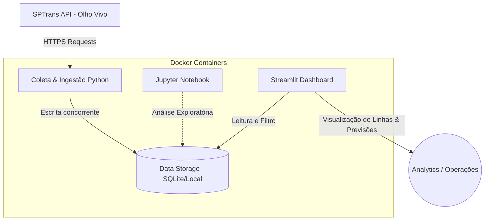

# 🚌 SPTrans Real-Time Public Transport Data Pipeline

Este projeto implementa um pipeline de ingestão e análise de dados em tempo real para o transporte público de São Paulo, consumindo dados geográficos e operacionais diretamente da **API Olho Vivo da SPTrans**. 

A arquitetura foi projetada para garantir resiliência operacional, modularização em containers e facilidade de análise exploratória, fornecendo dados prontos para visualização e inteligência de transporte.

---

## 🏗️ Arquitetura do Sistema

O sistema é totalmente dockerizado e modularizado em microserviços compartilhando o mesmo ambiente isolado:



### Serviços do Docker Compose:
*   **`coleta-posicoes`**: Coletor autônomo que realiza polling contínuo de geolocalização dos ônibus.
*   **`coleta-previsoes`**: Coletor contínuo focado em capturar as estimativas de chegada dos veículos nas paradas.
*   **`dashboard`**: Painel Streamlit que expõe indicadores de tráfego, atrasos e posições ativas em mapas.
*   **`notebook`**: Ambiente Jupyter Lab para exploração analítica dos dados coletados.
*   **`analise`**: Módulo isolado de análise estatística de dados históricos.

---

## 🛠️ Stack Tecnológica

*   **Linguagem Core:** Python 3.11
*   **Infraestrutura e DataOps:** Docker, Docker Compose, Make
*   **Armazenamento de Dados:** SQLite (Time-series estruturado local)
*   **Visualização e BI:** Streamlit, Pandas, Plotly/Matplotlib
*   **Integrações:** Requests, urllib3 (com tratativas de conexões e retentativas)

---

## ⚡ Decisões de Engenharia & Resiliência
1. **Compartilhamento de Configurações (`x-base-service`)**: O arquivo Docker Compose usa a sintaxe de âncora YAML para compartilhar a fundação comum entre coletores, Jupyter e Streamlit, reduzindo a duplicação e simplificando a manutenção da imagem.
2. **Ingestão Concorrente Segura**: O design separa a coleta de posições geográficas e de previsões de parada em processos paralelos e autônomos. Se a API da SPTrans falhar em previsões, o mapeamento de posições continua rodando sem impacto.
3. **Resiliência e Recuperação de Falhas**: Configuração de `restart: unless-stopped` nos containers de coleta garante que falhas de rede com a API da SPTrans reiniciem a thread de consumo automaticamente sem intervenção humana.

---

## 🚀 Como Rodar o Pipeline

### Pré-requisitos
* Docker e Docker Compose instalados na máquina.
* Token de Acesso da API Olho Vivo da SPTrans (cadastre-se no portal da SPTrans Developer).

### Configuração de Variáveis de Ambiente
Crie um arquivo `.env` na raiz do projeto ou configure sua chave de API nos coletores:
```bash
SPTRANS_API_TOKEN=seu_token_aqui
```

### Inicialização Rápida
O projeto conta com scripts auxiliares de controle:

1. **Subir todo o ecossistema:**
   ```bash
   ./run_all.sh
   ```
   *Este script inicializará os coletores em segundo plano, o banco de dados e preparará o ambiente.*

2. **Subir apenas o Dashboard Streamlit:**
   ```bash
   docker compose run --service-ports dashboard
   ```
   Acesse no navegador: `http://localhost:8501`

3. **Subir o Jupyter Lab para Análise Exploratória:**
   ```bash
   docker compose run --service-ports notebook
   ```
   Acesse no navegador: `http://localhost:8888` (sem senha configurada por padrão para ambiente local dev).

4. **Encerrar todos os containers:**
   ```bash
   ./stop_all.sh
   ```
